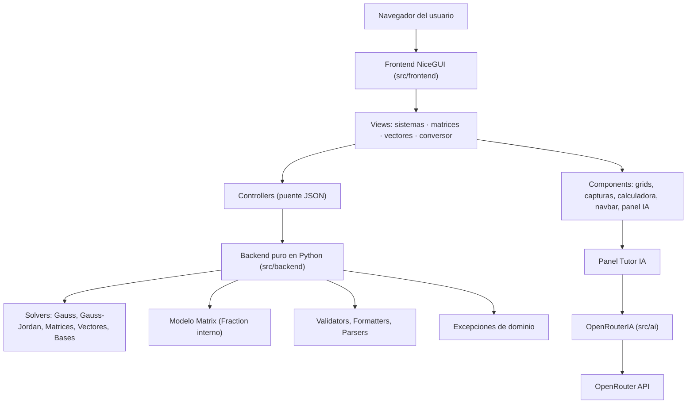
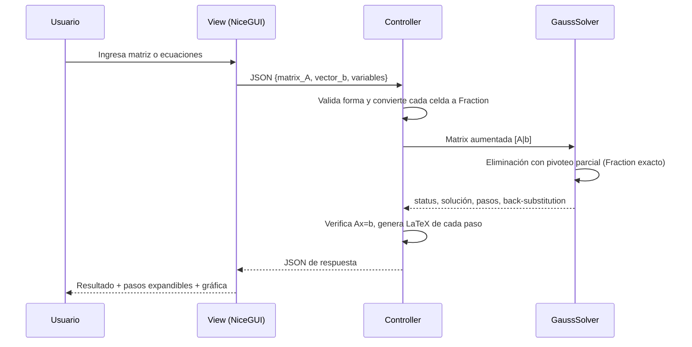

# 📐 Calculadora de Álgebra Lineal — UAM

> Sistemas lineales, matrices, vectores y bases numéricas, resueltos con **aritmética exacta**, explicados **paso a paso**, y acompañados por un **tutor de IA** — todo dentro de una interfaz que se toma tan en serio el diseño como las matemáticas.


---

## 🎯 Por qué existe este proyecto

Casi todas las calculadoras de álgebra lineal que circulan por ahí hacen lo mismo mal: convierten tus números a `float`, acumulan error de redondeo en cada paso de la eliminación gaussiana, y al final te muestran un `1.9999999998` donde debería decir `2`. Para un estudiante que está aprendiendo a razonar sobre rango, consistencia y espacios solución, ese ruido numérico no es un detalle menor: **es ruido pedagógico**.

Este proyecto nace para resolver exactamente ese problema. Es una calculadora web construida en Python (backend + frontend en el mismo lenguaje, gracias a [NiceGUI](https://nicegui.io/)) que:

- Nunca convierte un número a `float` si puede evitarlo. Todo el álgebra interna corre sobre `fractions.Fraction`.
- Explica **cada paso** de cada algoritmo — eliminación gaussiana, operaciones matriciales, combinaciones lineales, conversión de bases — con la misma seriedad con la que lo haría un profesor en la pizarra.
- Verifica sus propias respuestas (`Ax = b`) antes de mostrártelas.
- Incluye un tutor de IA que puede leer el sistema que tienes en pantalla y ayudarte a razonar sobre él.
- Está construido con una cultura de pruebas poco común en proyectos de este tamaño: más de 30 archivos de tests que existen, en su mayoría, para **cazar regresiones de precisión numérica** antes de que lleguen a un estudiante.

No es una tarea universitaria disfrazada de proyecto. Es una demostración de ingeniería de software aplicada, con cuidado, a las matemáticas que se enseñan en un curso de Álgebra Lineal.

---

## 📋 Índice

1. [Mapa rápido de módulos](#-mapa-rápido-de-módulos)
2. [Características principales](#-características-principales)
3. [El pilar del proyecto: precisión exacta](#-el-pilar-del-proyecto-precisión-exacta)
4. [Arquitectura](#-arquitectura)
5. [Stack tecnológico](#-stack-tecnológico)
6. [Estructura de carpetas](#-estructura-de-carpetas)
7. [Rutas de la aplicación](#-rutas-de-la-aplicación)
8. [Instalación y puesta en marcha](#-instalación-y-puesta-en-marcha)
9. [Configuración del Tutor IA](#-configuración-del-tutor-ia)
10. [Sistema de diseño visual](#-sistema-de-diseño-visual)
11. [Experiencia de usuario y atajos](#-experiencia-de-usuario-y-atajos)
12. [Testing](#-testing)
13. [Manejo de errores y validación](#-manejo-de-errores-y-validación)
14. [Convenciones de código](#-convenciones-de-código)
15. [Preguntas frecuentes](#-preguntas-frecuentes)
16. [Roadmap e ideas de extensión](#-roadmap-e-ideas-de-extensión)
17. [Contribuir](#-contribuir)
18. [Licencia](#-licencia)
19. [Créditos](#-créditos)

---

## 🗺️ Mapa rápido de módulos

| Módulo | Ruta | Qué resuelve | Motor detrás |
|---|---|---|---|
| **Sistemas Lineales** | `/sistemas-lineales` | Sistemas de ecuaciones por Gauss o Gauss-Jordan | `GaussSolver` / `GaussJordanSolver` |
| **Operaciones con Matrices** | `/operaciones-matrices` | Expresiones matriciales complejas (`2A - B(C - Dᵀ)`) | `MatrixExpressionEvaluator` |
| **Operaciones con Vectores** | `/vectores` | Suma/resta, escalar × vector, combinación lineal | `VectorOpsSolver` |
| **Conversor de Bases** | `/conversor` | Binario ⇄ Octal ⇄ Decimal ⇄ Hexadecimal | `ConversorBases` |
| **Tutor IA** | panel global | Chat contextual sobre lo que tienes en pantalla | `OpenRouterIA` |

---

## ✨ Características principales

### 1. Sistemas de Ecuaciones Lineales (`/sistemas-lineales`)

El módulo insignia. Permite resolver sistemas de hasta **10×10** por dos caminos que se mantienen sincronizados:

- **Modo Matriz**: una cuadrícula editable con navegación por teclado (flechas, `Enter`), *paste* directo desde Excel/Sheets (TSV), resaltado en cruz de fila/columna al enfocar una celda, y animaciones de entrada/salida al agregar o quitar ecuaciones/variables.
- **Modo Ecuaciones**: escribes literalmente `2x + 3y = 8`, `x - y = 1`, etc. El parser (`SystemParser`) entiende coeficientes implícitos, fracciones (`1/2 x`), múltiples términos constantes en el lado izquierdo (`2x + 5 = 10` se reinterpreta como `2x = 5`), y ordena las variables de forma natural (`x1, x2, ..., x10`, no lexicográfica).
- Un botón de **sincronización** convierte de un modo al otro en cualquier momento sin perder información.

Ambos métodos disponibles —**Gauss** (forma escalonada) y **Gauss-Jordan** (forma escalonada reducida)— comparten el mismo motor de eliminación con **pivoteo parcial** (se elige siempre el mayor valor absoluto de la columna para minimizar inestabilidad numérica) y aritmética 100% exacta con `Fraction`.

El resultado clasifica el sistema en una de tres categorías, con su explicación algebraica:

| Estado | Significado | Qué se muestra |
|---|---|---|
| `UNIQUE_SOLUTION` | Sistema consistente determinado | Valor exacto de cada variable + verificación `Ax = b` |
| `INFINITE_SOLUTIONS` | Sistema consistente indeterminado | Solución paramétrica (`x₁ = 2 - (1/3)t`) con variables libres nombradas `t, s, r, u, v` (y `t₆, t₇...` si hacen falta más) |
| `NO_SOLUTION` | Sistema inconsistente | Mensaje explicando en qué fila aparece la contradicción |

Además:

- **Vista previa en vivo**: mientras escribes, un panel lateral renderiza en LaTeX tanto la matriz aumentada como el sistema de ecuaciones equivalente, con *debounce* de 300 ms.
- **Historial de sesión**: las últimas 5 resoluciones quedan disponibles con un botón "Restaurar".
- **Visualización gráfica**: para sistemas de 2 o 3 incógnitas, se dibujan las rectas (2D) o los planos (3D) con Plotly, marcando la solución única cuando existe.
- **Comprobación automática**: cuando hay solución única, se sustituye de vuelta en el sistema original (`Ax = b`) y se muestra ecuación por ecuación si el resultado cuadra.

### 2. Operaciones con Matrices (`/operaciones-matrices`)

No es una calculadora de "una operación a la vez": es un **evaluador de expresiones algebraicas completas**. Puedes escribir cosas como:

```
2A - B(C - Dᵀ)
AB + 3C
-A + (-B)
```

El evaluador (`MatrixExpressionEvaluator`) tokeniza la expresión, resuelve multiplicación implícita (`AB` → `A * B`, `2A` → `2 * A`, `A(B)` → `A * (B)`), normaliza la transpuesta (`^T` o `^t` → `ᵀ`), respeta la precedencia del signo negativo unario (`A*-B`, `--A`) y aplica el **algoritmo Shunting-Yard** para convertir a notación polaca inversa antes de evaluar.

Cada sub-operación de la expresión se descompone en un **segmento** independiente con su propio LaTeX simbólico, resultado, y —para sumas, restas y multiplicaciones matriciales— el detalle celda por celda de cómo se llegó a cada número.

Puedes trabajar con hasta **26 matrices simultáneas** (nombradas automáticamente A–Z), cada una de hasta 10×10, con los mismos atajos de teclado, *paste* y animaciones que el módulo de sistemas.

### 3. Operaciones con Vectores (`/vectores`)

Tres herramientas en un mismo panel con pestañas:

- **Suma / Resta**: acepta vectores fila o columna. Por defecto, si mezclas orientaciones (un vector fila con uno columna de la misma dimensión), el sistema **transpone automáticamente** y te avisa del ajuste; un modo *"Estricto"* desactiva esa cortesía si quieres que el sistema rechace la mezcla.
- **Escalar × Vector**: multiplicación por un escalar (entero, decimal o fracción como `3/4`), con traza paso a paso por componente.
- **Combinación Lineal**: la pregunta clásica de todo curso de Álgebra Lineal — *¿es **b** combinación lineal de estos vectores?* Internamente arma la matriz aumentada `[v₁|v₂|...|vₖ|b]` y **reutiliza el mismo `GaussSolver`** que el módulo de sistemas (cero duplicación de lógica). Devuelve tres posibles veredictos:
  - **Representación única**: te da los coeficientes exactos `c₁, c₂, ..., cₖ` y un paso de **verificación** que sustituye esos coeficientes y confirma que reproducen `b` componente a componente.
  - **Infinitas representaciones**: te da la solución paramétrica y te dice cuáles son las variables libres.
  - **No es combinación lineal**: b está fuera del generado (*span*) de esos vectores.

### 4. Conversor de Bases Numéricas (`/conversor`)

Convierte entre **binario, octal, decimal y hexadecimal**, con soporte para números negativos y prefijos (`0b`, `0o`, `0x`). No se limita a dar el resultado:

- Muestra la **expansión posicional** completa cuando el origen no es decimal (dígito × baseᵖᵒᵗᵉⁿᶜⁱᵃ, sumados término a término).
- Muestra las **divisiones sucesivas** cuando el destino no es decimal, con la tabla de cocientes/residuos y la indicación de "se lee de abajo hacia arriba".
- Dibuja una **tira de bits** visual (hasta 32 bits) donde cada casilla indica su peso posicional (`2ⁿ`) al pasar el cursor.
- Trae chips de ejemplos rápidos por base y un botón para pegar directamente desde el portapapeles.

### 5. Tutor de IA (panel global)

Un panel deslizante, disponible en **todas** las vistas, conectado a [OpenRouter](https://openrouter.ai/) con reintentos automáticos y *fallback* entre modelos. No es un chatbot genérico: tiene un *system prompt* específico para tutoría de Álgebra Lineal, en español, e instruido para **no usar LaTeX/`$$`** dentro del chat (porque en un chat de texto plano, LaTeX sin renderizar es ruido, no ayuda) — usa notación en texto plano, ordenada y legible.

La función más interesante es **"Adjuntar contexto"**: con un clic, el panel toma el sistema, las matrices o los vectores que tienes activos en la vista actual y los inyecta en tu próximo mensaje, para que puedas preguntar directamente *"¿por qué este sistema tiene infinitas soluciones?"* sin tener que volver a escribir los números.

El historial de conversación persiste durante la sesión (vía `app.storage.user`, con *fallback* automático a `app.storage.client` si no configuraste `STORAGE_SECRET`), y las respuestas de la IA se muestran con efecto de máquina de escribir.

---

## 🔢 El pilar del proyecto: precisión exacta

Esta es, sin exagerar, la razón de ser del proyecto. Compará:

```python
>>> 1 / 1001
0.0009990009990009992          # ❌ un float ya perdió información

>>> from fractions import Fraction
>>> Fraction("1/1001")
Fraction(1, 1001)              # ✅ exactamente lo que el estudiante escribió
```

Cada número que entra al backend —ya sea desde una celda de matriz, un coeficiente de ecuación, un escalar o un vector— pasa por `MatrixValidator.parse_number_exact`, que lo convierte a `Fraction` **sin pasar por `float` en ningún punto intermedio**. La eliminación gaussiana (`gauss.py`) calcula cada factor de eliminación y cada nueva fila con `Fraction` puro, así que un sistema con denominador 1001 en la solución **sigue mostrando `1/1001`**, no `1/1000` truncado por error.

Este cuidado se extiende a los *formatters*: `format_fraction_str` y `number_to_latex` (en `src/backend/utils/formatters.py`) tienen una regla de oro que aparece documentada explícitamente en el código: **`Fraction`/`int` nunca se aproximan**. El único lugar donde se aplica `limit_denominator` es al intentar *recuperar* una fracción simple a partir de un `float` que llegó de fuera del sistema (por ejemplo, resultado intermedio de una gráfica) — y solo si la reconstrucción, al convertirla de vuelta a `float`, coincide con el original dentro de una tolerancia estrictísima.

Las tolerancias no están regadas como *magic numbers* por el código: viven centralizadas en `src/backend/constants.py`.

| Constante | Valor | Para qué se usa |
|---|---|---|
| `ZERO_EPSILON` | `1e-9` | Umbral general de "esto es cero" (pivotes, igualdad de matrices) |
| `FRACTION_MATCH_TOLERANCE` | `1e-6` | Tolerancia al recuperar una fracción simple desde un `float` en LaTeX |
| `DISPLAY_DECIMALS` | `4` | Decimales de respaldo cuando no hay fracción simple que mostrar |
| `SOLUTION_VERIFICATION_TOLERANCE` | `1e-4` | Verificación numérica aproximada |
| `DISPLAY_FRACTION_TOLERANCE` | `1e-4` | Tolerancia al aceptar una fracción reconstruida como "igual" al float original |
| `FRACTION_RECONSTRUCTION_LIMIT` | `1000` | Límite de denominador al reconstruir un `Fraction` desde `float`/`string` en el backend (`Matrix`) |
| `FRACTION_DISPLAY_LIMIT` | `1000` | Ídem, pero en la capa de presentación (`formatters`) |
| `LATEX_DENOMINATOR_LIMIT` | `100` | Ídem, específico para fracciones LaTeX recuperadas desde `float` |

Y para que esto no sea solo una promesa en el README: hay **decenas de tests dedicados exclusivamente a cazar regresiones de precisión** — `test_formatters_exact.py`, `test_gauss_precision.py`, `test_matrix_normalize.py`, `test_evaluator_literal_precision.py`, `test_verify_solution_exact.py`, entre otros — todos con el mismo espíritu: *si alguien vuelve a introducir un `limit_denominator` de más, un test debe romperse antes de que un estudiante vea un `1/1000` donde debería decir `1/1001`.*

---

## 🏗️ Arquitectura

El proyecto separa con disciplina **qué calcula** de **cómo se ve**. El backend (`src/backend/`) es Python puro: no importa NiceGUI, no sabe que existe una interfaz web, y por lo tanto se puede testear en aislamiento total (de ahí la pila de tests que no levanta ni un solo componente de UI). El frontend (`src/frontend/`) habla con el backend exclusivamente a través de **controllers** que son, en esencia, una API JSON interna: reciben un payload, lo validan, se lo pasan a un *solver*, y devuelven una respuesta serializada.



Un ejemplo concreto del flujo, para el caso más usado — resolver un sistema:



### Las tres capas, en detalle

1. **`src/backend/`** — el corazón matemático.
   - `models/matrix.py`: la clase `Matrix`, con normalización estricta de cada celda a `Fraction`.
   - `solvers/`: un subpaquete por dominio (`linear_systems`, `matrix_ops`, `vector_ops`, `numeric_systems`), cada uno con su propio solver y su propia lógica de trazabilidad.
   - `utils/`: `formatters.py` (número → texto/LaTeX), `validators.py` (parseo y verificación), `parsers.py` (texto de ecuaciones → `Matrix`), `math_utils.py` (MCD/MCM).
   - `exceptions.py`: jerarquía de errores de dominio (`AlgebraLinealError` hereda de `ValueError` a propósito, para retrocompatibilidad con código que hace `except ValueError`).
   - `constants.py`: todas las tolerancias numéricas en un solo lugar.

2. **`src/frontend/controllers/`** — el traductor. Cada controller expone métodos estáticos que reciben JSON (string), lo validan explícitamente (nada de `except Exception` genérico tapando errores de programación), construyen objetos de dominio, invocan al solver correspondiente, y devuelven JSON. `linear_systems/_shared.py` centraliza la validación que Gauss y Gauss-Jordan comparten, para que una corrección se aplique a ambos por igual.

3. **`src/frontend/views/` + `components/`** — la experiencia. Las *views* orquestan una página completa; los *components* son piezas reutilizables (la cuadrícula de matriz, el panel de captura de vectores, la calculadora en pantalla, la barra de navegación, el panel del tutor IA).

4. **`src/ai/`** — el módulo de tutoría, aislado del resto: solo sabe hablar con OpenRouter, no conoce la lógica matemática.

---

## 🧰 Stack tecnológico

| Capa | Tecnología | Rol |
|---|---|---|
| Backend matemático | Python puro + `fractions.Fraction` | Aritmética exacta, cero dependencias externas |
| UI / Framework web | [NiceGUI](https://nicegui.io/) (sobre FastAPI + Vue/Quasar) | Frontend reactivo escrito 100% en Python |
| Render matemático | [MathJax 3](https://www.mathjax.org/) (vía CDN) | LaTeX en vivo para matrices, ecuaciones y pasos |
| Gráficas | [Plotly](https://plotly.com/python/) (opcional) | Rectas 2D y planos 3D de sistemas lineales |
| Tutor IA | [OpenRouter](https://openrouter.ai/) vía `requests` | Chat con *fallback* multi-modelo |
| Config | `python-dotenv` | Carga de `.env` |
| Tipografía | Space Grotesk (Google Fonts) | Identidad visual |
| Testing | `pytest` (+ `pytest-anyio` para el único test asíncrono) | Suite de regresión, con foco en precisión numérica |

---

## 📁 Estructura de carpetas

```text
src/
├── ai/                          # Integración con OpenRouter (tutor IA)
│   └── openrouter_ai.py
│
├── backend/                     # Python puro — sin dependencias de UI
│   ├── models/matrix.py         # Clase Matrix (Fraction interno)
│   ├── solvers/
│   │   ├── linear_systems/      # GaussSolver, GaussJordanSolver
│   │   ├── matrix_ops/          # MatrixOpsSolver, MatrixExpressionEvaluator
│   │   ├── vector_ops/          # VectorOpsSolver
│   │   └── numeric_systems/     # ConversorBases
│   ├── utils/                   # formatters, validators, parsers, math_utils
│   ├── constants.py             # Tolerancias numéricas centralizadas
│   ├── exceptions.py            # Jerarquía de errores de dominio
│   └── test_backend.py          # Script de demostración manual (no es la suite de tests)
│
├── frontend/
│   ├── assets/                  # Logos (claro/oscuro) para splash y favicon
│   ├── components/              # Piezas de UI reutilizables (grids, capturas, navbar, IA)
│   ├── controllers/              # Puente JSON entre views y backend
│   ├── views/                   # Una vista por módulo (sistemas, matrices, vectores, bases)
│   ├── app.py                   # Setup de NiceGUI, rutas, theming, splash screen
│   ├── helpers.py                # Utilidades de conversión/formato para la UI
│   └── theme.py                  # Paleta de colores para gráficas
│
├── __init__.py
└── main.py                      # (placeholder — el entry point real vive en frontend/app.py)

tests/                           # +30 archivos de tests, ver sección Testing
```

---

## 🗺️ Rutas de la aplicación

| Ruta | Descripción |
|---|---|
| `/` | Redirige a `/sistemas-lineales` |
| `/sistemas-lineales` | Página principal: matriz/ecuaciones, Gauss o Gauss-Jordan (acepta `?method=gauss` o `?method=gauss-jordan`) |
| `/gauss` | Atajo que redirige a `/sistemas-lineales?method=gauss` |
| `/gauss-jordan` | Atajo que redirige a `/sistemas-lineales?method=gauss-jordan` |
| `/operaciones-matrices` | Evaluador de expresiones matriciales |
| `/vectores` | Suma/resta, escalar × vector, combinación lineal |
| `/conversor` | Conversor de bases numéricas |
| `/ia` | Redirige a `/sistemas-lineales` — el tutor IA es un panel global, no una página propia |

---

## 🚀 Instalación y puesta en marcha

### Requisitos

- **Python 3.10+** (el proyecto usa sintaxis de tipos moderna, `list[int] | None`, en todo el backend).
- Conexión a internet solo si quieres usar el **Tutor IA** o la carga de **MathJax/Google Fonts** desde CDN.

### 1. Clonar y entrar al proyecto

```bash
git clone <url-del-repositorio>
cd <carpeta-del-proyecto>
```

### 2. Crear entorno virtual

```bash
python -m venv .venv
source .venv/bin/activate      # Linux / macOS
.venv\Scripts\activate         # Windows
```

### 3. Instalar dependencias

El repositorio no trae (todavía) un `requirements.txt` versionado en los archivos revisados, así que este es un punto de partida fiel a los imports detectados en el código fuente:

```bash
pip install nicegui requests python-dotenv plotly pytest pytest-anyio
```

> 💡 Si en tu copia del repositorio ya existe un `requirements.txt` o `pyproject.toml`, úsalo como fuente de verdad — la lista de arriba es una reconstrucción razonada a partir de los `import` reales del código.

### 4. Configurar variables de entorno

Copiá el ejemplo (o creá el archivo si no existe todavía) y completá tus valores:

```bash
cp .env.example .env      # el .gitignore del proyecto está preparado para versionar .env.example
```

Contenido esperado de `.env`:

```dotenv
# Tutor IA — obtené tu clave en https://openrouter.ai/keys
OPENROUTER_API_KEY=sk-or-v1-tu-clave-aqui

# Opcional — modelo principal (por defecto: nex-agi/nex-n2.5-pro:free)
OPENROUTER_PRIMARY_MODEL=nex-agi/nex-n2.5-pro:free

# Opcional — modelos de respaldo, separados por coma
OPENROUTER_FALLBACK_MODELS=modelo-a:free,modelo-b:free

# Recomendado — habilita almacenamiento persistente por usuario (chat del tutor, panel abierto/cerrado)
# Sin esto, la app sigue funcionando pero usa almacenamiento por cliente (se pierde al refrescar)
STORAGE_SECRET=una-cadena-larga-y-aleatoria
```

Un detalle a favor de la resiliencia: la app busca el `.env` en **dos ubicaciones** (`load_dotenv(".env")` y `load_dotenv("src/ai/.env")`), así que podés colocar tus credenciales de IA junto al módulo que las consume si preferís mantenerlas separadas del resto de la config.

### 5. Ejecutar

```bash
python -m src.main
```
*(También podés ejecutar directamente `python src/main.py`)*

Abrí **http://localhost:8080** en tu navegador. NiceGUI levanta el servidor con recarga automática ante cambios en el código.

> ℹ️ El entry point principal vive en `src/main.py`, que delega en el composition root `src/frontend/app.py` y asegura la recarga automática (multiprocessing de NiceGUI) y resolución de módulos desde la raíz.

### Higiene del repositorio

El `.gitignore` ya viene preparado para un flujo de trabajo limpio:

- `.env` y variantes quedan fuera de git (pero `.env.example` sí se versiona, a propósito).
- `.nicegui/` es la carpeta de almacenamiento local que NiceGUI genera en tiempo de ejecución — no se versiona.
- Cachés de Python, entornos virtuales, configuraciones de editor, archivos de sistema operativo y artefactos de `pytest`/cobertura quedan excluidos por defecto.

---

## 🤖 Configuración del Tutor IA

El motor vive en `src/ai/openrouter_ai.py` (`OpenRouterIA`). Algunos detalles que vale la pena conocer si vas a tocarlo o depurarlo:

- **System prompt fijo**, en español, instruyendo al modelo a comportarse como *"un tutor experto en álgebra lineal ayudando a estudiantes de ingeniería en la UAM"* y, de forma explícita, a **no usar LaTeX ni `$$`** — todo en texto plano ordenado, porque el chat no renderiza LaTeX.
- **Resiliencia con *fallback* multi-modelo**: primero intenta `OPENROUTER_PRIMARY_MODEL`, y si falla, recorre `OPENROUTER_FALLBACK_MODELS` en orden.
- **Reintentos inteligentes**: hasta 2 intentos por modelo, con backoff (`1.5 * intento` segundos) ante códigos transitorios (`429`, `500`, `502`, `503`, `504`, y también los `52x` propios de Cloudflare).
- **Manejo de errores claro**: si falta la clave, el mensaje literalmente te dice que revises que el archivo se llame `.env` y no `.env.txt` (un error de despiste más común de lo que parece).
- **Historial acotado**: solo se envían los últimos 10 mensajes de la conversación a la API, para no inflar el costo/latencia indefinidamente.
- **Contexto adjunto**: el botón 📎 del panel toma —según la vista activa— el sistema de ecuaciones, el diccionario de matrices, o el diccionario de vectores, y lo antepone a tu próximo mensaje como `[Contexto adjunto]`.

Si no configurás `OPENROUTER_API_KEY`, el resto de la aplicación (sistemas, matrices, vectores, conversor) sigue funcionando exactamente igual — el tutor simplemente te devolverá un mensaje explicando qué falta.

---

## 🎨 Sistema de diseño visual

El proyecto llama a su propio lenguaje visual **"neumorfismo editorial de precisión"**, y lo sostiene con un sistema de *design tokens* en CSS (espaciado en base 4px, radios, escala tipográfica, curvas de movimiento) compartido entre tres temas:

| Tema | Estilo | Fondo |
|---|---|---|
| **Papel** *(por defecto)* | Claro, cálido | `#F2F0EB` |
| **Marea** | Claro, frío/azulado | `#EDF2F8` |
| **Medianoche** | Oscuro | `#082338` |

El cambio de tema no es un simple `class="dark"`: usa la **View Transitions API** para animar una revelación circular desde el punto exacto donde hiciste clic, con *fallback* silencioso en navegadores que no la soportan, y respeta `prefers-reduced-motion` en todo momento.

Otros detalles cuidados a propósito:

- **Splash screen** de 3 segundos en la primera carga de sesión (logo, anillo de progreso trazándose, texto revelado con `clip-path`), que se salta automáticamente si el usuario prefiere movimiento reducido.
- **Animación de "recolección de basura"** en el botón Limpiar: cada celda con contenido se clona visualmente y "vuela" hacia el ícono de la papelera antes de vaciarse, con efecto *squash & bounce* al terminar.
- **Resaltado en cruz**: al enfocar una celda de matriz, toda su fila y columna se iluminan sutilmente — útil para no perderte en sistemas grandes.
- Tipografía **Space Grotesk** en toda la interfaz, con `font-variant-numeric: tabular-nums` en las celdas para que los dígitos no "bailen" al cambiar de valor.

---

## ⌨️ Experiencia de usuario y atajos

Pensado para gente que resuelve muchos sistemas seguidos, no solo uno:

- **Navegación por teclado** en cualquier grid (matriz, captura de matrices, captura de vectores): flechas para moverte entre celdas, `Enter` para bajar una fila.
- ***Paste* de tablas**: copiá un rango de Excel/Google Sheets y pegalo directo sobre cualquier celda — el sistema distribuye los valores respetando filas y columnas (formato TSV).
- **Pegar desde portapapeles** con un botón dedicado en el conversor de bases.
- **Sincronización bidireccional** entre modo Matriz y modo Ecuaciones en el módulo de sistemas lineales.
- **Historial de sesión** con restauración de un clic (sistemas lineales).
- **Vista previa en vivo** en LaTeX mientras escribís, con *debounce* para no saturar el render.
- Botones de **copiar resultado** con confirmación visual (✓ temporal) en el conversor de bases.

---

## ✅ Testing

La carpeta `tests/` (distinta del script de demostración manual `src/backend/test_backend.py`) contiene más de 30 archivos organizados por responsabilidad:

| Categoría | Archivos representativos | Qué protege |
|---|---|---|
| **Controllers** | `test_controller_gauss.py`, `test_controller_gauss_jordan.py`, `test_controller_matrix_ops.py`, `test_controller_consistency.py` | Validación de payload, JSON malformado, consistencia de `status` entre controllers |
| **Precisión numérica** | `test_formatters_exact.py`, `test_gauss_precision.py`, `test_matrix_normalize.py`, `test_evaluator_literal_precision.py`, `test_evaluator_precision.py`, `test_verify_solution_exact.py` | Que ningún `Fraction` se trunque silenciosamente |
| **Núcleo algorítmico** | `test_eliminacion.py`, `test_gauss_solution_exact.py` | Casos clásicos: solución única, infinitas soluciones, inconsistencia |
| **Parser de ecuaciones** | `test_parser_disjoint.py`, `test_parser_zero_row.py` | Sistemas disjuntos, filas `0 = k`, constantes movidas de lado |
| **Vectores** | `test_vector_ops.py`, `test_vector_linear_combination.py` | Auto-transposición, modo estricto, combinación lineal con `free_cols` exactos |
| **Integración** | `test_integration_rules.py`, `test_shared_augmented.py` | El pipeline completo, de extremo a extremo |
| **UI lógica pura** | `test_conversor_ui_logic.py`, `test_frontend_helpers.py` | Lógica de la vista del conversor sin necesidad de levantar NiceGUI |
| **Cobertura de revisor** | `test_reviewer_coverage.py` | Casos borde encontrados en revisión de código: precedencia del `-` unario, dimensiones incompatibles, índices fuera de rango |

### Cómo correrlos

```bash
pytest
```

Para ver detalle por test:

```bash
pytest tests/ -v
```

Para correr solo un archivo (útil mientras trabajás en un módulo puntual):

```bash
pytest tests/test_gauss_precision.py -v
```

> El archivo `tests/test_conversor_ui_logic.py` incluye un test asíncrono marcado con `@pytest.mark.anyio`, por lo que `pytest-anyio` (o el plugin `anyio` para pytest) debe estar instalado para que la suite completa corra sin errores de colección.

---

## 🛡️ Manejo de errores y validación

El proyecto trata los errores de entrada del usuario como **datos esperables**, no como excepciones a atrapar por accidente:

- Una jerarquía de excepciones propia (`AlgebraLinealError` y sus subclases: `DimensionMismatchError`, `MatrixDataError`, `InvalidNumberError`, `SingularSystemError`, `InvalidVectorError`) hereda deliberadamente de `ValueError`, para que código existente que hace `except ValueError` siga funcionando sin cambios.
- Los *validators* devuelven tuplas `(ok: bool, valor, mensaje: str)` en lugar de lanzar excepciones para errores de entrada esperables — las excepciones se reservan para violaciones de invariantes internos.
- Los **controllers nunca dejan escapar un traceback** hacia el frontend: cada uno captura explícitamente los tipos de error que su lógica puede producir y siempre responde con un JSON `{"status": "ERROR", "message": "..."}` con un mensaje en español, específico y —cuando aplica— con la **coordenada exacta** de la celda problemática (`"Error en A[2,3]: ..."`).
- `verify_solution` (la comprobación final `Ax = b`) hace un *pre-parseo estricto* de cada celda antes de calcular nada: si algo no es numérico, falla con un mensaje claro en vez de tratarlo silenciosamente como `0` (una falla silenciosa real que existió y quedó cubierta por tests de regresión).

---

## 📐 Convenciones de código

Algunas decisiones deliberadas que notarás si explorás el código fuente:

- **Todo en español** — nombres de clases, docstrings, mensajes de error, comentarios. Es consistente con el público objetivo (estudiantes de la UAM) y con la voz del tutor IA.
- **Cero *magic numbers***: cualquier tolerancia numérica vive en `constants.py`, nunca hardcodeada en medio de un algoritmo.
- **Backend sin dependencias de UI**: nada en `src/backend/` importa NiceGUI. Esto es lo que permite testear el 100% de la lógica matemática sin levantar un navegador.
- **Controllers como adaptadores delgados**: su trabajo es validar forma, convertir tipos, invocar al solver y serializar — nunca contienen lógica matemática propia.
- **Docstrings que explican el "por qué", no solo el "qué"** — por ejemplo, en `gauss.py`: *"Matrix.get() ya garantiza Fraction exacto. Reaplicar `limit_denominator(1000)` truncaría fracciones con denominador > 1000 e introduciría error silencioso en la solución."* Ese tipo de comentario aparece una y otra vez, y es, en el fondo, la memoria institucional del proyecto sobre errores que ya se cometieron y no se quieren repetir.

---

## ❓ Preguntas frecuentes

**¿Por qué no usar NumPy si ya resuelve sistemas lineales?**
Porque NumPy trabaja sobre `float64` por diseño (está optimizado para rendimiento numérico, no para exactitud simbólica). Para un estudiante que necesita ver `1/7` y no `0.142857...ish`, eso es exactamente lo que este proyecto evita.

**¿Funciona sin conexión a internet?**
Sí, para los cuatro módulos matemáticos. El Tutor IA necesita conexión (habla con la API de OpenRouter), y la tipografía/MathJax se cargan desde CDN por defecto.

**¿Cuál es el tamaño máximo de sistema/matriz/vector soportado?**
10×10 para sistemas y matrices individuales; hasta 26 matrices simultáneas (A–Z) en el evaluador de expresiones; hasta 9 vectores en la combinación lineal (el vector `b` más 8 vectores generadores); dimensión de vector hasta 10.

**¿Qué pasa si el sistema tiene más de 5 variables libres?**
Los nombres `t, s, r, u, v` se agotan rápido — a partir de la sexta variable libre, el sistema nombra automáticamente `t₆, t₇, ...` para no chocar nombres.

**¿Por qué a veces el sistema "ajusta la orientación" de un vector sin preguntarme?**
Es el comportamiento por defecto (no estricto) de suma/resta de vectores: si mezclás un vector fila con uno columna de la misma dimensión, el sistema transpone automáticamente y te lo informa como un paso explícito. Activá el modo *"Estricto"* si preferís que lo rechace en su lugar.

---

## 🧭 Roadmap e ideas de extensión

Algunas direcciones naturales para quien quiera seguir construyendo sobre esta base (no son promesas, son invitaciones):

- Completar `src/main.py` como entry point real que delegue en `src/frontend/app.py`, para tener un único comando de arranque documentado en el propio código.
- Publicar un `requirements.txt` / `pyproject.toml` versionado con rangos de versión fijados.
- Extender el conversor de bases a bases arbitrarias (no solo 2/8/10/16).
- Sumar más operaciones vectoriales clásicas (producto punto, norma, proyección, ortogonalidad) reutilizando el mismo patrón de trazabilidad paso a paso.
- Exportar el procedimiento resuelto a PDF/Word para entrega de tareas.
- Añadir un modo "examen" con generación aleatoria de sistemas y verificación automática de la respuesta del estudiante.

---

## 🤝 Contribuir

1. Hacé un *fork* y creá una rama descriptiva (`feature/producto-punto`, `fix/precision-conversor`).
2. Si tocás algo del backend, agregá o actualizá tests en `tests/` — este proyecto vive y muere por su cobertura de regresión numérica.
3. Corré `pytest` antes de abrir el PR. Un cambio que rompe la precisión exacta de una fracción no es un detalle menor acá: es exactamente el tipo de bug que este proyecto existe para prevenir.
4. Mantené la convención de comentarios/docstrings en español y el estilo "explica el por qué" cuando el código no sea autoevidente.

---

## 📄 Licencia

Este repositorio no incluye actualmente un archivo `LICENSE` explícito en los documentos revisados. Si sos el/la autor/a del proyecto y pensás distribuirlo o aceptar contribuciones externas, considerá agregar una licencia (MIT es una elección común y permisiva para proyectos académicos) para dejar claro qué se puede hacer con el código.

---

## 🙌 Créditos

Construido para el curso de Álgebra Lineal de la **UAM**, con la convicción de que una herramienta educativa no tiene por qué elegir entre ser rigurosa y ser agradable de usar. Si este proyecto te ayudó a entender un pivoteo parcial, una combinación lineal, o simplemente a no perder la paciencia con `1/1001`, ya cumplió su propósito.

---

<p align="center">
  <sub>Hecho con Python, Fraction, y la terquedad de no redondear nada que no haga falta.</sub>
</p>
